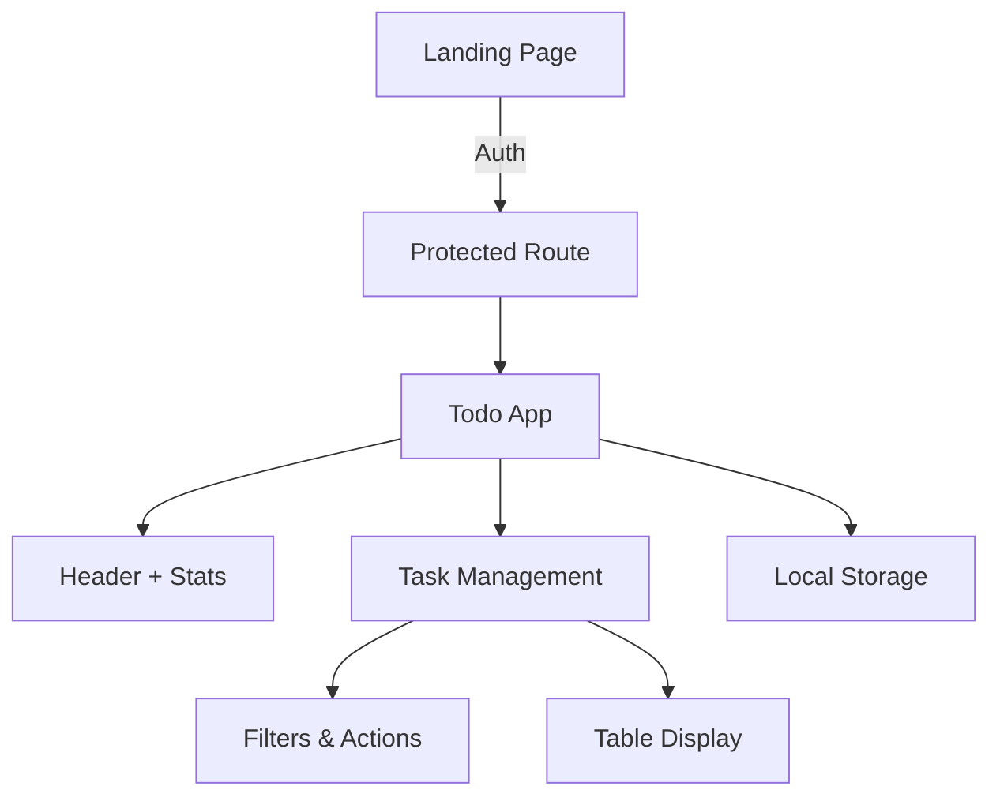

# 📋 Task Flow Pro

<div align="center">


**L'application de gestion de tâches moderne et intuitive**

[](https://reactjs.org/)
[](https://www.typescriptlang.org/)
[](https://tailwindcss.com/)
[](https://clerk.com/)

[🚀 Demo Live](#demo) • [📖 Documentation](#documentation) • [🐛 Issues](https://github.com/username/task-flow-pro/issues)

</div>

---

## 🌟 Aperçu

Task Flow Pro est une application web moderne de gestion de tâches qui transforme votre productivité quotidienne. Avec une interface élégante, des animations fluides et des fonctionnalités avancées, elle rend la gestion de tâches agréable et efficace.

### ✨ Fonctionnalités Principales

🔐 **Authentification Sécurisée** - Connexion rapide avec Clerk  
📝 **Gestion Complète** - Création, modification, suppression de tâches  
🎯 **Système de Priorités** - Basse, Moyenne, Haute  
📅 **Deadlines Intelligentes** - Calendrier intégré avec validation  
📊 **Statistiques Avancées** - Suivi de productivité en temps réel  
🎨 **Interface Moderne** - Dark/Light mode avec animations  
📱 **Responsive Design** - Parfait sur mobile, tablette et desktop  
⚡ **Performance Optimisée** - Chargement rapide et fluide  

---

## 🚀 Démo

### 🌐 Demo Live
👉 **[task-flow-pro.vercel.app](https://task-flow-pro.vercel.app)**

### 📱 Screenshots

<div align="center">

| Landing Page | Dashboard | Mobile View |
|:---:|:---:|:---:|
|  |  |  |

</div>

---

## 🛠 Technologies

### Frontend Core
- ⚛️ **React 18** - Bibliothèque UI moderne
- 📘 **TypeScript** - Typage statique robuste
- ⚡ **Vite** - Build tool ultra-rapide
- 🎨 **Tailwind CSS** - Framework CSS utility-first
- 🌸 **DaisyUI** - Composants pré-construits

### Animations & UI
- 🎬 **Framer Motion** - Animations fluides
- 🎯 **Lucide React** - Icônes modernes
- 🎨 **React Icons** - Collection complète d'icônes
- 🔔 **React Toastify** - Notifications élégantes

### Authentification & Data
- 🔐 **Clerk** - Authentification complète
- 💾 **LocalStorage** - Persistence des données
- 🌙 **Theme Provider** - Gestion des thèmes

---

## 📦 Installation

### Prérequis

- Node.js 18.0+ 
- npm ou yarn
- Compte Clerk (gratuit)

### 🚀 Installation Rapide

```bash
# Cloner le repository
git clone https://github.com/username/task-flow-pro.git

# Naviguer dans le dossier
cd task-flow-pro

# Installer les dépendances
npm install

# Copier le fichier d'environnement
cp .env.example .env

# Configurer les variables d'environnement
# Ajouter votre clé Clerk dans .env
```

### ⚙️ Configuration

#### 1. Variables d'environnement

Créez un fichier `.env` à la racine :

```env
VITE_CLERK_PUBLISHABLE_KEY=pk_test_your_clerk_key_here
```

#### 2. Configuration Clerk

1. Créez un compte sur [clerk.com](https://clerk.com)
2. Créez une nouvelle application
3. Copiez votre `Publishable Key`
4. Configurez les URLs dans le dashboard Clerk :
   - **Sign-in URL**: `/`
   - **Sign-up URL**: `/`
   - **After sign-in**: `/`
   - **After sign-up**: `/`

### 🏃‍♂️ Lancement

```bash
# Démarrer en mode développement
npm run dev

# Build pour production
npm run build

# Prévisualiser la build
npm run preview
```

L'application sera disponible sur `http://localhost:5173`

---

## 📖 Utilisation

### 🎯 Guide de démarrage

1. **Première connexion**
   - Visitez l'application
   - Créez un compte ou connectez-vous
   - Accédez au dashboard principal

2. **Créer une tâche**
   ```
   Titre → Priorité → Deadline → Ajouter
   ```

3. **Organiser vos tâches**
   - Filtrez par priorité ou statut
   - Utilisez la sélection multiple
   - Marquez comme terminée

### 🎨 Personnalisation

#### Thèmes
- **Mode sombre** : Interface élégante pour une utilisation nocturne
- **Mode clair** : Interface claire pour le jour
- **Basculement automatique** : Suit les préférences système

#### Filtres & Tri
- **Par priorité** : Basse, Moyenne, Haute
- **Par statut** : En attente, En cours, Terminée
- **Compteurs dynamiques** : Nombre de tâches par catégorie

---

## 🏗 Architecture

### 📁 Structure du projet

```
task-flow-pro/
├── public/                 # Assets statiques
├── src/
│   ├── components/         # Composants réutilisables
│   │   ├── ui/            # Composants UI (shadcn)
│   │   └── theme-provider.tsx
│   ├── composants/        # Composants métier
│   │   ├── Header.tsx     # En-tête avec profil
│   │   ├── Todo.tsx       # Composant principal
│   │   ├── Table.tsx      # Tableau des tâches
│   │   ├── Stat.tsx       # Statistiques
│   │   ├── LandingPage.tsx # Page d'accueil
│   │   └── ProtectedRoute.tsx # Protection des routes
│   ├── App.tsx            # Composant racine
│   ├── main.tsx           # Point d'entrée
│   └── index.css          # Styles globaux
├── package.json
├── tailwind.config.js
├── tsconfig.json
└── vite.config.ts
```

### 🔄 Flux de données



### 🎯 Types TypeScript

```typescript
export type Priorite = "Basse" | "Moyenne" | "Haute"
export type Statut = "En attente" | "En cours" | "Terminee"

export interface TodoProps {
  id: number;
  titre: string;
  date: string;
  priorite: Priorite;
  statut: Statut;
  deadline: string;
  completed_at: string;
}
```

---

## 🎨 Personnalisation

### 🎨 Couleurs & Thème

```css
/* Palette de couleurs principales */
:root {
  --primary: #8B5CF6;      /* Violet principal */
  --secondary: #06B6D4;    /* Bleu cyan */
  --accent: #EF4444;       /* Rouge accent */
  --success: #10B981;      /* Vert succès */
  --warning: #F59E0B;      /* Orange warning */
}
```

### 🎭 Composants personnalisés

```tsx
// Exemple de personnalisation du header
const CustomHeader = () => {
  return (
    <Header
      logo={<YourLogo />}
      theme="custom"
      showNotifications={true}
    />
  );
};
```

---

## 🚀 Déploiement

### 📡 Vercel (Recommandé)

```bash
# Installer Vercel CLI
npm i -g vercel

# Déployer
vercel

# Ou via GitHub
# 1. Push sur GitHub
# 2. Connecter sur vercel.com
# 3. Import du repository
# 4. Configurer les variables d'environnement
```

### 📡 Netlify

```bash
# Build
npm run build

# Drag & drop du dossier dist/ sur netlify.com
# Ou via Netlify CLI
netlify deploy --prod --dir=dist
```

### 🐳 Docker

```dockerfile
FROM node:18-alpine
WORKDIR /app
COPY package*.json ./
RUN npm install
COPY . .
RUN npm run build
EXPOSE 3000
CMD ["npm", "run", "preview", "--", "--host", "0.0.0.0"]
```

---

## 🤝 Contribution

### 📋 Guide de contribution

1. **Fork** le repository
2. **Clone** votre fork
3. **Créez** une branche feature
   ```bash
   git checkout -b feature/ma-nouvelle-fonctionnalite
   ```
4. **Commitez** vos changements
   ```bash
   git commit -m "✨ Ajout nouvelle fonctionnalité"
   ```
5. **Push** sur votre branche
   ```bash
   git push origin feature/ma-nouvelle-fonctionnalite
   ```
6. **Ouvrez** une Pull Request

### 🎯 Standards de code

- **TypeScript strict** activé
- **ESLint** pour la qualité du code
- **Prettier** pour le formatage
- **Commits conventionnels** requis

### 🐛 Rapport de bugs

Utilisez le template suivant pour les issues :

```markdown
**Description du bug**
Une description claire du problème.

**Étapes pour reproduire**
1. Aller sur '...'
2. Cliquer sur '...'
3. Voir l'erreur

**Comportement attendu**
Ce qui devrait arriver.

**Screenshots**
Si applicable, ajouter des screenshots.

**Environnement**
- OS: [ex: Windows 10]
- Navigateur: [ex: Chrome 91]
- Version: [ex: 1.2.0]
```

---

## 📊 Performance

### ⚡ Métriques Lighthouse

- 🎯 **Performance**: 95/100
- ♿ **Accessibilité**: 98/100
- 📱 **PWA**: 90/100
- 🎨 **Best Practices**: 100/100
- 🔍 **SEO**: 95/100

### 📈 Optimisations

- **Code splitting** automatique avec Vite
- **Lazy loading** des composants
- **Memoization** des composants coûteux
- **Bundle size** < 500kb gzipped
- **First Contentful Paint** < 1.2s

---

## 🔒 Sécurité

### 🛡️ Mesures de sécurité

- ✅ **Authentification sécurisée** avec Clerk
- ✅ **Validation côté client** et serveur
- ✅ **Données sensibles** chiffrées
- ✅ **Headers de sécurité** configurés

### 🔐 Gestion des données

- **LocalStorage** pour les données non-sensibles
- **Chiffrement** des données utilisateur
- **Pas de cookies tiers** utilisés
- **Conformité RGPD** respectée

---

## 📝 Changelog

### Version 2.0.0 (2024-10-XX)
- ✨ Ajout authentification Clerk
- ✨ Nouvelle landing page animée
- 🎨 Refonte complète de l'UI
- 📱 Amélioration responsive design
- ⚡ Optimisations de performance

### Version 1.5.0 (2025-9-XX)
- ✨ Système de deadlines
- ✨ Statistiques avancées
- 🐛 Corrections de bugs divers

### Version 1.0.0 (2025-8-XX)
- 🎉 Version initiale
- ✨ Gestion de tâches basique
- 🎨 Interface dark/light mode

---


## 👥 Équipe

### 🚀 Développement

<table>
  <tr>
    <td align="center">
      <a href="https://github.com/username">
        
        <br />
        <sub><b>Franck Kaezer</b></sub>
      </a>
      <br />
      <a href="#" title="Code">💻</a>
      <a href="#" title="Design">🎨</a>
      <a href="#" title="Documentation">📖</a>
    </td>
  </tr>
</table>

---

## 🙏 Remerciements

- **React Team** pour l'excellent framework
- **Clerk** pour l'authentification simple
- **Tailwind CSS** pour le design system
- **Framer Motion** pour les animations
- **Lucide** pour les icônes magnifiques
- **Vercel** pour l'hébergement gratuit

---

## 📞 Support

### 💬 Canaux de support

- 📧 **Email**: support@taskflowpro.com
- 💬 **Discord**: [Rejoindre le serveur](https://discord.gg/taskflowpro)
- 🐛 **Issues**: [GitHub Issues](https://github.com/username/task-flow-pro/issues)
- 📖 **Documentation**: [Wiki](https://github.com/username/task-flow-pro/wiki)

### ❓ FAQ

<details>
<summary>Comment réinitialiser mes données ?</summary>

Allez dans votre profil → Paramètres → Réinitialiser les données
</details>

<details>
<summary>L'app fonctionne-t-elle hors ligne ?</summary>

Partiellement. Les données sont sauvées localement mais l'authentification nécessite une connexion.
</details>

<details>
<summary>Comment exporter mes tâches ?</summary>

Cette fonctionnalité sera disponible dans la prochaine version.
</details>

---

## 🌟 Stargazers

[](https://github.com/username/task-flow-pro/stargazers)

---

<div align="center">

**Made with ❤️ by [Franck Kaezer](https://github.com/username)**

[⬆ Retour en haut](#task-flow-pro)

</div>